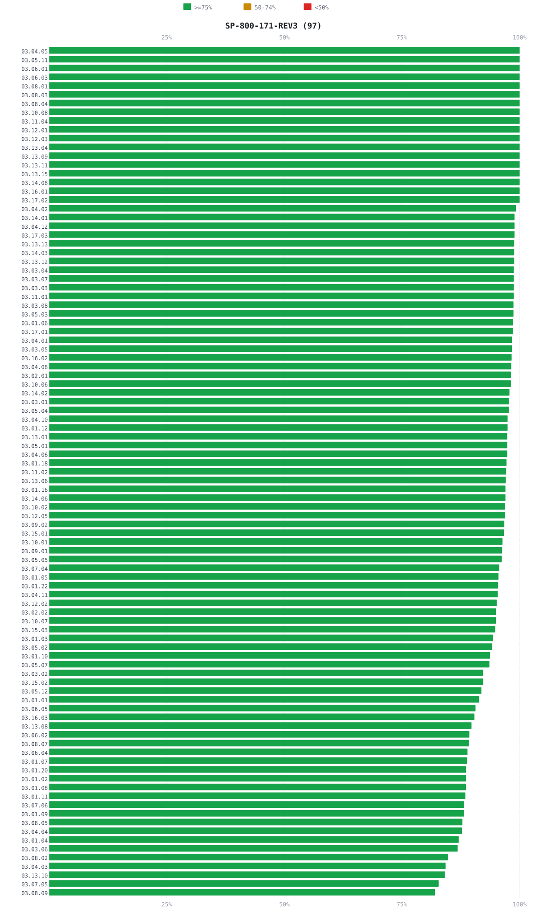

# Catalog Comparison Report

Compares the AI-generated NIST SP 800-171 Rev.3 OSCAL catalog (produced from the source PDF by the `compliance-catalog` skill) against the [official NIST OSCAL content](https://github.com/usnistgov/oscal-content).

  

    
95%

    
Average prose similarity vs. NIST

    
across 97 active controls

  

  

    
130/130Controls reproduced

    
0Missing

    
0Extra

    
0Title delta

  

> **Prose similarity** is computed with word-level Jaccard overlap after stripping OSCAL parameter references (`{{ insert: param, … }}`), PDF assignment placeholders (`[Assignment: …]`), and `Related Control(s): …` lines (PDF artifact).  The worst-scoring 25% of controls are listed in the dissimilar-controls table.

## Summary

| Baseline | Generated | Official | Delta | Missing | Extra | Title Delta | Avg prose sim | Dissimilar |
|---|---:|---:|---:|---:|---:|---:|---:|---:|
| sp-800-171-rev3 | 130 | 130 | +0 | 0 | 0 | 0 | 95% | 24 |

## Prose similarity per control

Each bar is one control — green >= 75%, yellow 50-74%, red < 50%.

---

<strong>Baseline: SP-800-171-REV3 — dissimilar controls (worst 25%, at or below 92%, 24 controls)</strong>

<strong>[03.08.09] — similarity 82%</strong>

| PDF (generated) | NIST OSCAL (official) |
|---|---|
| <mark>a. </mark>Protect the confidentiality of backup information.<mark> b.</mark> Implement cryptographic mechanisms to prevent the unauthorized disclosure of CUI at backup storage locations. The selection of cryptographic mechanisms is based on the need to protect the confidentiality of backup information. Hardware security module (HSM) devices safeguard and manage cryptographic keys and provide cryptographic processing. Cryptographic operations (e.g., encryption, decryption, and signature generation and verification) are typically hosted on the HSM device, and many implementations provide hardware-accelerated mechanisms for cryptographic operations. This requirement is related to 03.13.11. | Protect the confidentiality of backup information. Implement cryptographic mechanisms to prevent the unauthorized disclosure of CUI at backup storage locations. The selection of cryptographic mechanisms is based on the need to protect the confidentiality of backup information. Hardware security module (HSM) devices safeguard and manage cryptographic keys and provide cryptographic processing. Cryptographic operations (e.g., encryption, decryption, and signature generation and verification) are typically hosted on the HSM device, and many implementations provide hardware-accelerated mechanisms for cryptographic operations. This requirement is related to <mark>\ </mark>03.13.11. |

<strong>[03.07.05] — similarity 83%</strong>

| PDF (generated) | NIST OSCAL (official) |
|---|---|
| <mark>a. </mark>Approve and monitor nonlocal maintenance and diagnostic activities.<mark> b.</mark> Implement multi-factor authentication and replay resistance in the establishment of nonlocal maintenance and diagnostic sessions.<mark> c.</mark> Terminate session and network connections when nonlocal maintenance is completed. Nonlocal maintenance and diagnostic activities are conducted by individuals who communicate through an external or internal network. Local maintenance and diagnostic activities are carried out by individuals who are physically present at the location of the system and not communicating across a network connection. Authentication techniques used to establish nonlocal maintenance and diagnostic sessions reflect the requirements in 03.05.01. | Approve and monitor nonlocal maintenance and diagnostic activities. Implement multi-factor authentication and replay resistance in the establishment of nonlocal maintenance and diagnostic sessions. Terminate session and network connections when nonlocal maintenance is completed. Nonlocal maintenance and diagnostic activities are conducted by individuals who communicate through an external or internal network. Local maintenance and diagnostic activities are carried out by individuals who are physically present at the location of the system and not communicating across a network connection. Authentication techniques used to establish nonlocal maintenance and diagnostic sessions reflect the requirements in <mark>\ </mark>03.05.01. |

<strong>[03.13.10] — similarity 84%</strong>

| PDF (generated) | NIST OSCAL (official) |
|---|---|
| Establish and manage cryptographic keys in the system in accordance with the following key management requirements: <mark>\[Assignment:</mark> <mark>organization-defined</mark> <mark>requirements</mark> <mark>for</mark> <mark>key generation, distribution, storage, access, and destruction].</mark> Cryptographic keys can be established and managed using either manual procedures or automated mechanisms supported by manual procedures. Organizations satisfy key establishment and management requirements in accordance with applicable federal laws, Executive Orders, policies, directives, regulations, and standards that specify appropriate options, levels, and parameters. This requirement is related to 03.13.11. | Establish and manage cryptographic keys in the system in accordance with the following key management requirements: <mark>.</mark> Cryptographic keys can be established and managed using either manual procedures or automated mechanisms supported by manual procedures. Organizations satisfy key establishment and management requirements in accordance with applicable federal laws, Executive Orders, policies, directives, regulations, and standards that specify appropriate options, levels, and parameters. This requirement is related to <mark>\ </mark>03.13.11. |

<strong>[03.04.03] — similarity 84%</strong>

| PDF (generated) | NIST OSCAL (official) |
|---|---|
| <mark>a. </mark>Define the types of changes to the system that are configuration-controlled.<mark> b.</mark> Review proposed configuration-controlled changes to the system, and approve or disapprove such changes with explicit consideration for security impacts. <mark>c. </mark>Implement and document approved configuration-controlled changes to the system.<mark> d.</mark> Monitor and review activities associated with configuration-controlled changes to the system. Configuration change control refers to tracking, reviewing, approving or disapproving, and logging changes to the system. Specifically, it involves the systematic proposal, justification, implementation, testing, review, and disposition of changes to the system, including system upgrades and modifications. Configuration change control includes changes to baseline configurations for system components (e.g., operating systems, applications, firewalls, routers, mobile devices) and configuration items of the system, changes to configuration settings, unscheduled and unauthorized changes, and changes to remediate vulnerabilities. This requirement is related to 03.04.04. | Define the types of changes to the system that are configuration-controlled. Review proposed configuration-controlled changes to the system, and approve or disapprove such changes with explicit consideration for security impacts. Implement and document approved configuration-controlled changes to the system. Monitor and review activities associated with configuration-controlled changes to the system. Configuration change control refers to tracking, reviewing, approving or disapproving, and logging changes to the system. Specifically, it involves the systematic proposal, justification, implementation, testing, review, and disposition of changes to the system, including system upgrades and modifications. Configuration change control includes changes to baseline configurations for system components (e.g., operating systems, applications, firewalls, routers, mobile devices) and configuration items of the system, changes to configuration settings, unscheduled and unauthorized changes, and changes to remediate vulnerabilities. This requirement is related to <mark>\ </mark>03.04.04. |

<strong>[03.08.02] — similarity 85%</strong>

| PDF (generated) | NIST OSCAL (official) |
|---|---|
| Restrict access to CUI on system media to authorized personnel or roles. System media include digital and non-digital media. Access to CUI on system media can be restricted by physically controlling such media. This includes conducting inventories, ensuring that procedures are in place to allow individuals to check out and return media to the media library, and maintaining accountability for stored media. For digital media, access to CUI can be restricted by using cryptographic means. Encrypting data in storage or at rest is addressed in 03.13.08. | Restrict access to CUI on system media to authorized personnel or roles. System media include digital and non-digital media. Access to CUI on system media can be restricted by physically controlling such media. This includes conducting inventories, ensuring that procedures are in place to allow individuals to check out and return media to the media library, and maintaining accountability for stored media. For digital media, access to CUI can be restricted by using cryptographic means. Encrypting data in storage or at rest is addressed in <mark>\ </mark>03.13.08. |

<strong>[03.03.06] — similarity 87%</strong>

| PDF (generated) | NIST OSCAL (official) |
|---|---|
| <mark>a. </mark>Implement an audit record reduction and report generation capability that supports audit record review, analysis, reporting requirements, and <mark>after-thefact</mark> investigations of incidents.<mark> b.</mark> Preserve the original content and time ordering of audit records. Audit records are generated in <mark>03.03.03.</mark> Audit record reduction and report generation occur after audit record generation. Audit record reduction is a process that manipulates collected audit information and organizes it in a summary format that is more meaningful to analysts. Audit record reduction and report generation capabilities do not always come from the same system or organizational entities that conduct auditing activities. An audit record reduction capability can include, for example, modern data mining techniques with advanced data filters to identify anomalous behavior in audit records. The report generation capability provided by the system can help generate customizable reports. The time ordering of audit records can be a significant issue if the granularity of the time stamp in the record is insufficient. | Implement an audit record reduction and report generation capability that supports audit record review, analysis, reporting requirements, and <mark>after-the-fact</mark> investigations of incidents. Preserve the original content and time ordering of audit records. Audit records are generated in <mark>\03.03.03.</mark> Audit record reduction and report generation occur after audit record generation. Audit record reduction is a process that manipulates collected audit information and organizes it in a summary format that is more meaningful to analysts. Audit record reduction and report generation capabilities do not always come from the same system or organizational entities that conduct auditing activities. An audit record reduction capability can include, for example, modern data mining techniques with advanced data filters to identify anomalous behavior in audit records. The report generation capability provided by the system can help generate customizable reports. The time ordering of audit records can be a significant issue if the granularity of the time stamp in the record is insufficient. |

<strong>[03.01.04] — similarity 87%</strong>

| PDF (generated) | NIST OSCAL (official) |
|---|---|
| <mark>a. </mark>Identify the duties of individuals requiring separation.<mark> b.</mark> Define system access authorizations to support separation of duties. Separation of duties addresses the potential for abuse of authorized privileges and reduces the risk of malevolent activity without collusion. Separation of duties includes dividing mission functions and support functions among different individuals or roles, conducting system support functions with different individuals or roles (e.g., quality assurance, configuration management, network security, system management, assessments, and programming), and ensuring that personnel who administer access control functions do not also administer audit functions. Because separation of duty violations can span systems and application domains, organizations consider the entirety of their systems and system components when developing policies on separation of duties. This requirement is enforced by 03.01.02. | Identify the duties of individuals requiring separation. Define system access authorizations to support separation of duties. Separation of duties addresses the potential for abuse of authorized privileges and reduces the risk of malevolent activity without collusion. Separation of duties includes dividing mission functions and support functions among different individuals or roles, conducting system support functions with different individuals or roles (e.g., quality assurance, configuration management, network security, system management, assessments, and programming), and ensuring that personnel who administer access control functions do not also administer audit functions. Because separation of duty violations can span systems and application domains, organizations consider the entirety of their systems and system components when developing policies on separation of duties. This requirement is enforced by <mark>\ </mark>03.01.02. |

<strong>[03.04.04] — similarity 88%</strong>

| PDF (generated) | NIST OSCAL (official) |
|---|---|
| <mark>a. </mark>Analyze changes to the system to determine potential security impacts prior to change implementation.<mark> b.</mark> Verify that the security requirements for the system continue to be satisfied after the system changes have been implemented. Organizational personnel with security responsibilities conduct impact analyses that include reviewing system security plans, policies, and procedures to understand security requirements; reviewing system design documentation and operational procedures to understand how system changes might affect the security state of the system; reviewing the impacts of system changes on supply chain partners with stakeholders; and determining how potential changes to a system create new risks and the ability to mitigate those risks. Impact analyses also include risk assessments to understand the impacts of changes and determine whether additional security requirements are needed. Changes to the system may affect the safeguards and countermeasures previously implemented. This requirement is related to <mark>03.04.03.</mark> Not all changes to the system are configuration controlled. | Analyze changes to the system to determine potential security impacts prior to change implementation. Verify that the security requirements for the system continue to be satisfied after the system changes have been implemented. Organizational personnel with security responsibilities conduct impact analyses that include reviewing system security plans, policies, and procedures to understand security requirements; reviewing system design documentation and operational procedures to understand how system changes might affect the security state of the system; reviewing the impacts of system changes on supply chain partners with stakeholders; and determining how potential changes to a system create new risks and the ability to mitigate those risks. Impact analyses also include risk assessments to understand the impacts of changes and determine whether additional security requirements are needed. Changes to the system may affect the safeguards and countermeasures previously implemented. This requirement is related to <mark>\03.04.03.</mark> Not all changes to the system are configuration controlled. |

<strong>[03.08.05] — similarity 88%</strong>

| PDF (generated) | NIST OSCAL (official) |
|---|---|
| <mark>a. </mark>Protect and control system media that contain CUI during transport outside of controlled areas. <mark>b. </mark>Maintain accountability of system media that contain CUI during transport outside of controlled areas.<mark> c.</mark> Document activities associated with the transport of system media that contain CUI. System media include digital and non-digital media. Digital media include flash drives, diskettes, magnetic tapes, external or removable solid state or magnetic drives, compact discs, and digital versatile discs. Non-digital media include microfilm and paper. Controlled areas are spaces for which organizations provide physical or procedural measures to meet the requirements established for protecting CUI and systems. Media protection during transport can include cryptography and/or locked containers. Activities associated with media transport include releasing media for transport, ensuring that media enter the appropriate transport processes, and the actual transport. Authorized transport and courier personnel may include individuals external to the organization. Maintaining accountability of media during transport includes restricting transport activities to authorized personnel and tracking or obtaining the records of transport activities as the media move through the transportation system to prevent and detect loss, destruction, or tampering. This requirement is related to <mark>03.13.08</mark> and 03.13.11. | Protect and control system media that contain CUI during transport outside of controlled areas. Maintain accountability of system media that contain CUI during transport outside of controlled areas. Document activities associated with the transport of system media that contain CUI. System media include digital and non-digital media. Digital media include flash drives, diskettes, magnetic tapes, external or removable solid state or magnetic drives, compact discs, and digital versatile discs. Non-digital media include microfilm and paper. Controlled areas are spaces for which organizations provide physical or procedural measures to meet the requirements established for protecting CUI and systems. Media protection during transport can include cryptography and/or locked containers. Activities associated with media transport include releasing media for transport, ensuring that media enter the appropriate transport processes, and the actual transport. Authorized transport and courier personnel may include individuals external to the organization. Maintaining accountability of media during transport includes restricting transport activities to authorized personnel and tracking or obtaining the records of transport activities as the media move through the transportation system to prevent and detect loss, destruction, or tampering. This requirement is related to <mark>\03.13.08</mark> and <mark>\ </mark>03.13.11. |

<strong>[03.01.09] — similarity 88%</strong>

| PDF (generated) | NIST OSCAL (official) |
|---|---|
| Display a system use notification message with privacy and security notices consistent with applicable CUI rules before granting access to the system. System use notifications can be implemented using messages or warning banners. The messages or warning banners are displayed before individuals log in to a system that processes, stores, or transmits CUI. System use notifications are used for access via logon interfaces with human users and are not required when human interfaces do not exist. Organizations consider whether a secondary use notification is needed to access applications or other system resources after the initial network logon. Posters or other printed materials may be used in lieu of an automated system message. This requirement is related to 03.15.03. | Display a system use notification message with privacy and security notices consistent with applicable CUI rules before granting access to the system. System use notifications can be implemented using messages or warning banners. The messages or warning banners are displayed before individuals log in to a system that processes, stores, or transmits CUI. System use notifications are used for access via logon interfaces with human users and are not required when human interfaces do not exist. Organizations consider whether a secondary use notification is needed to access applications or other system resources after the initial network logon. Posters or other printed materials may be used in lieu of an automated system message. This requirement is related to <mark>\ </mark>03.15.03. |

<strong>[03.07.06] — similarity 88%</strong>

| PDF (generated) | NIST OSCAL (official) |
|---|---|
| <mark>a. </mark>Establish a process for maintenance personnel authorization.<mark> b.</mark> Maintain a list of authorized maintenance organizations or personnel.<mark> c.</mark> Verify that non-escorted personnel who perform maintenance on the system possess the required access authorizations.<mark> d.</mark> Designate organizational personnel with required access authorizations and technical competence to supervise the maintenance activities of personnel who do not possess the required access authorizations. Maintenance personnel refers to individuals who perform hardware or software maintenance on the system, while <mark>03.10.01</mark> addresses physical access for individuals whose maintenance duties place them within the physical protection perimeter of the system. The technical competence of supervising individuals relates to the maintenance performed on the system, while having required access authorizations refers to maintenance on and near the system. Individuals who have not been previously identified as authorized maintenance personnel (e.g., manufacturers, consultants, systems integrators, and vendors) may require privileged access to the system, such as when they are required to conduct maintenance with little or no notice. Organizations may choose to issue temporary credentials to these individuals based on their risk assessments. Temporary credentials may be for one-time use or for very limited time periods. | Establish a process for maintenance personnel authorization. Maintain a list of authorized maintenance organizations or personnel. Verify that non-escorted personnel who perform maintenance on the system possess the required access authorizations. Designate organizational personnel with required access authorizations and technical competence to supervise the maintenance activities of personnel who do not possess the required access authorizations. Maintenance personnel refers to individuals who perform hardware or software maintenance on the system, while <mark>\03.10.01</mark> addresses physical access for individuals whose maintenance duties place them within the physical protection perimeter of the system. The technical competence of supervising individuals relates to the maintenance performed on the system, while having required access authorizations refers to maintenance on and near the system. Individuals who have not been previously identified as authorized maintenance personnel (e.g., manufacturers, consultants, systems integrators, and vendors) may require privileged access to the system, such as when they are required to conduct maintenance with little or no notice. Organizations may choose to issue temporary credentials to these individuals based on their risk assessments. Temporary credentials may be for one-time use or for very limited time periods. |

<strong>[03.01.11] — similarity 89%</strong>

| PDF (generated) | NIST OSCAL (official) |
|---|---|
| Terminate a user session automatically after <mark>\[Assignment:</mark> <mark>organization-defined</mark> <mark>conditions</mark> <mark>or</mark> <mark>trigger events requiring session disconnect].</mark> This requirement addresses the termination of user-initiated logical sessions in contrast to the termination of network connections that are associated with communications sessions (i.e., disconnecting from the network) in <mark>03.13.09.</mark> A logical session is initiated whenever a user (or processes acting on behalf of a user) accesses a system. Logical sessions can be terminated (and thus terminate user access) without terminating network sessions. Session termination ends all system processes associated with a user’s logical session except those processes that are created by the user (i.e., session owner) to continue after the session is terminated. Conditions or trigger events that require automatic session termination can include organization-defined periods of user inactivity, time-of-day restrictions on system use, and targeted responses to certain types of incidents. | Terminate a user session automatically after <mark>.</mark> This requirement addresses the termination of user-initiated logical sessions in contrast to the termination of network connections that are associated with communications sessions (i.e., disconnecting from the network) in <mark>\03.13.09.</mark> A logical session is initiated whenever a user (or processes acting on behalf of a user) accesses a system. Logical sessions can be terminated (and thus terminate user access) without terminating network sessions. Session termination ends all system processes associated with a user’s logical session except those processes that are created by the user (i.e., session owner) to continue after the session is terminated. Conditions or trigger events that require automatic session termination can include organization-defined periods of user inactivity, time-of-day restrictions on system use, and targeted responses to certain types of incidents. |

<strong>[03.01.08] — similarity 89%</strong>

| PDF (generated) | NIST OSCAL (official) |
|---|---|
| <mark>a. </mark>Enforce a limit of <mark>\[Assignment:</mark> <mark>organization-defined</mark> <mark>number]</mark> consecutive invalid logon attempts by a user during a <mark>\[Assignment:</mark> <mark>organization-defined</mark> <mark>time</mark> <mark>period].</mark> <mark>b.</mark> Automatically <mark>\[Selection</mark> <mark>(one</mark> <mark>or</mark> <mark>more):</mark> <mark>lock the account or node for an \[Assignment: organization-defined time period]; lock the account or node until released by an administrator; delay next logon prompt; notify system administrator; take other action]</mark> when the maximum number of unsuccessful attempts is exceeded. Due to the potential for denial of service, automatic system lockouts are in most cases, temporary and automatically release after a predetermined time period established by the organization (i.e., using a delay algorithm). Organizations may employ different delay algorithms for different system components based on the capabilities of the respective components. Responses to unsuccessful system logon attempts may be implemented at the system and application levels. Organization-defined actions that may be taken include prompting the user to answer a secret question in addition to the username and password, invoking a lockdown mode with limited user capabilities (instead of a full lockout), allowing users to only logon from specified Internet Protocol (IP) addresses, requiring a CAPTCHA to prevent automated attacks, or applying user profiles, such as location, time of day, IP address, device, or Media Access Control (MAC) address. | Enforce a limit of <mark>{{</mark> <mark>insert:</mark> <mark>param, A.03.01.08.ODP.01 }}</mark> consecutive invalid logon attempts by a user during a <mark>.</mark> Automatically <mark></mark> when the maximum number of unsuccessful attempts is exceeded. Due to the potential for denial of service, automatic system lockouts are in most cases, temporary and automatically release after a predetermined time period established by the organization (i.e., using a delay algorithm). Organizations may employ different delay algorithms for different system components based on the capabilities of the respective components. Responses to unsuccessful system logon attempts may be implemented at the system and application levels. Organization-defined actions that may be taken include prompting the user to answer a secret question in addition to the username and password, invoking a lockdown mode with limited user capabilities (instead of a full lockout), allowing users to only logon from specified Internet Protocol (IP) addresses, requiring a CAPTCHA to prevent automated attacks, or applying user profiles, such as location, time of day, IP address, device, or Media Access Control (MAC) address. |

<strong>[03.01.02] — similarity 89%</strong>

| PDF (generated) | NIST OSCAL (official) |
|---|---|
| Enforce approved authorizations for logical access to CUI and system resources in accordance with applicable access control policies. Access control policies control access between active entities or subjects (i.e., users or system processes acting on behalf of users) and passive entities or objects (i.e., devices, files, records, domains) in organizational systems. Types of system access include remote access and access to systems that communicate through external networks, such as the internet. Access enforcement mechanisms can also be employed at the application and service levels to provide increased protection for CUI. This recognizes that the system can host many applications and services in support of mission and business functions. Access control policies are defined in 03.15.01. | Enforce approved authorizations for logical access to CUI and system resources in accordance with applicable access control policies. Access control policies control access between active entities or subjects (i.e., users or system processes acting on behalf of users) and passive entities or objects (i.e., devices, files, records, domains) in organizational systems. Types of system access include remote access and access to systems that communicate through external networks, such as the internet. Access enforcement mechanisms can also be employed at the application and service levels to provide increased protection for CUI. This recognizes that the system can host many applications and services in support of mission and business functions. Access control policies are defined in <mark>\ </mark>03.15.01. |

<strong>[03.01.20] — similarity 89%</strong>

| PDF (generated) | NIST OSCAL (official) |
|---|---|
| <mark>a. </mark>Prohibit the use of external systems unless the systems are specifically authorized.<mark> b.</mark> Establish the following security requirements to be satisfied on external systems prior to allowing use of or access to those systems by authorized individuals: <mark>\[Assignment:</mark> <mark>organization-defined</mark> <mark>security</mark> <mark>requirements].</mark> <mark>c.</mark> Permit authorized individuals to use external systems to access the organizational system or to process, store, or transmit CUI only after: <mark>1. </mark>Verifying that the security requirements on the external systems as specified in the organization’s system security plans have been satisfied and <mark>2. </mark>Retaining approved system connection or processing agreements with the organizational entities hosting the external systems.<mark> d.</mark> Restrict the use of organization-controlled portable storage devices by authorized individuals on external systems. External systems are systems that are used by but are not part of the organization. These systems include personally owned systems, system components, or devices; privately owned computing and communication devices in commercial or public facilities; systems owned or controlled by nonfederal organizations; and systems managed by contractors. Organizations have the option to prohibit the use of any type of external system or specified types of external systems (e.g., prohibit the use of external systems that are not organizationally owned). Terms and conditions are consistent with the trust relationships established with the entities that own, operate, or maintain external systems and include descriptions of shared responsibilities. Authorized individuals include organizational personnel, contractors, or other individuals with authorized access to the organizational system and over whom organizations have the authority to impose specific rules of behavior regarding system access. Restrictions that organizations impose on authorized individuals may vary depending on the trust relationships between organizations. Organizations need assurance that external systems satisfy the necessary security requirements so as not to compromise, damage, or harm the system. This requirement is related to 03.16.03. | Prohibit the use of external systems unless the systems are specifically authorized. Establish the following security requirements to be satisfied on external systems prior to allowing use of or access to those systems by authorized individuals: <mark>.</mark> Permit authorized individuals to use external systems to access the organizational system or to process, store, or transmit CUI only after: Verifying that the security requirements on the external systems as specified in the organization’s system security plans have been satisfied and Retaining approved system connection or processing agreements with the organizational entities hosting the external systems. Restrict the use of organization-controlled portable storage devices by authorized individuals on external systems. External systems are systems that are used by but are not part of the organization. These systems include personally owned systems, system components, or devices; privately owned computing and communication devices in commercial or public facilities; systems owned or controlled by nonfederal organizations; and systems managed by contractors. Organizations have the option to prohibit the use of any type of external system or specified types of external systems (e.g., prohibit the use of external systems that are not organizationally owned). Terms and conditions are consistent with the trust relationships established with the entities that own, operate, or maintain external systems and include descriptions of shared responsibilities. Authorized individuals include organizational personnel, contractors, or other individuals with authorized access to the organizational system and over whom organizations have the authority to impose specific rules of behavior regarding system access. Restrictions that organizations impose on authorized individuals may vary depending on the trust relationships between organizations. Organizations need assurance that external systems satisfy the necessary security requirements so as not to compromise, damage, or harm the system. This requirement is related to <mark>\ </mark>03.16.03. |

<strong>[03.01.07] — similarity 89%</strong>

| PDF (generated) | NIST OSCAL (official) |
|---|---|
| <mark>a. </mark>Prevent non-privileged users from executing privileged functions.<mark> b.</mark> Log the execution of privileged functions. Privileged functions include establishing system accounts, performing system integrity checks, conducting patching operations, changing system configuration settings, or administering cryptographic key management activities. Non-privileged users do not possess the authorizations to execute privileged functions. Bypassing intrusion detection and prevention mechanisms or malicious code protection mechanisms are examples of privileged functions that require protection from <mark>nonprivileged</mark> users. This requirement represents a condition achieved by the definition of authorized privileges in <mark>03.01.01</mark> and privilege enforcement in <mark>03.01.02.</mark> The misuse of privileged functions — whether intentionally or unintentionally by authorized users or by unauthorized external entities that have compromised system accounts — is a serious and ongoing concern that can have significant adverse impacts on organizations. Logging the use of privileged functions is one way to detect such misuse and mitigate risks from advanced persistent threats and insider threats. | Prevent non-privileged users from executing privileged functions. Log the execution of privileged functions. Privileged functions include establishing system accounts, performing system integrity checks, conducting patching operations, changing system configuration settings, or administering cryptographic key management activities. Non-privileged users do not possess the authorizations to execute privileged functions. Bypassing intrusion detection and prevention mechanisms or malicious code protection mechanisms are examples of privileged functions that require protection from <mark>non-privileged</mark> users. This requirement represents a condition achieved by the definition of authorized privileges in <mark>\03.01.01</mark> and privilege enforcement in <mark>\03.01.02.</mark> The misuse of privileged functions — whether intentionally or unintentionally by authorized users or by unauthorized external entities that have compromised system accounts — is a serious and ongoing concern that can have significant adverse impacts on organizations. Logging the use of privileged functions is one way to detect such misuse and mitigate risks from advanced persistent threats and insider threats. |

<strong>[03.06.04] — similarity 89%</strong>

| PDF (generated) | NIST OSCAL (official) |
|---|---|
| <mark>a. </mark>Provide incident response training to system users consistent with assigned roles and responsibilities: <mark>1. </mark>Within <mark>\[Assignment:</mark> <mark>organization-defined</mark> <mark>time</mark> <mark>period]</mark> of assuming an incident response role or responsibility or acquiring system access, <mark>2. </mark>When required by system changes, and <mark>3.</mark> <mark>\[Assignment:</mark> <mark>organization-defined</mark> <mark>frequency]</mark> thereafter.<mark> b.</mark> Review and update incident response training content <mark>\[Assignment:</mark> <mark>organization-defined</mark> <mark>frequency]</mark> and following <mark>\[Assignment:</mark> <mark>organization-defined</mark> <mark>events].</mark> Incident response training is associated with the assigned roles and responsibilities of organizational personnel to ensure that the appropriate content and level of detail are included in such training. For example, users may only need to know how to recognize an incident or whom to call; system administrators may require additional training on how to handle incidents; and incident responders may receive specific training on data collection techniques, forensics, reporting, system recovery, and system restoration. Incident response training includes user training in identifying and reporting suspicious activities from external and internal sources. Incident response training for users may be provided as part of <mark>03.02.02.</mark> Events that may cause an update to incident response training content include incident response plan testing, response to an actual incident, audit or assessment findings, or changes in applicable laws, Executive Orders, policies, directives, regulations, standards, and guidelines. | Provide incident response training to system users consistent with assigned roles and responsibilities: Within <mark>{{</mark> <mark>insert:</mark> <mark>param,</mark> <mark>A.03.06.04.ODP.01 }}</mark> of assuming an incident response role or responsibility or acquiring system access, When required by system changes, and <mark>{{</mark> <mark>insert:</mark> <mark>param,</mark> <mark>A.03.06.04.ODP.02 }}</mark> thereafter. Review and update incident response training content <mark>{{</mark> <mark>insert:</mark> <mark>param, A.03.06.04.ODP.03 }}</mark> and following <mark>{{</mark> <mark>insert:</mark> <mark>param, A.03.06.04.ODP.04 }}.</mark> Incident response training is associated with the assigned roles and responsibilities of organizational personnel to ensure that the appropriate content and level of detail are included in such training. For example, users may only need to know how to recognize an incident or whom to call; system administrators may require additional training on how to handle incidents; and incident responders may receive specific training on data collection techniques, forensics, reporting, system recovery, and system restoration. Incident response training includes user training in identifying and reporting suspicious activities from external and internal sources. Incident response training for users may be provided as part of <mark>\03.02.02.</mark> Events that may cause an update to incident response training content include incident response plan testing, response to an actual incident, audit or assessment findings, or changes in applicable laws, Executive Orders, policies, directives, regulations, standards, and guidelines. |

<strong>[03.08.07] — similarity 89%</strong>

| PDF (generated) | NIST OSCAL (official) |
|---|---|
| <mark>a. </mark>Restrict or prohibit the use of <mark>\[Assignment:</mark> <mark>organization-defined</mark> <mark>types</mark> <mark>of</mark> <mark>system media]. b.</mark> Prohibit the use of removable system media without an identifiable owner. In contrast to requirement <mark>03.08.01,</mark> which restricts user access to media, this requirement restricts or prohibits the use of certain types of media, such as external hard drives, flash drives, or smart displays. Organizations can use technical and <mark>nontechnical</mark> measures (e.g., policies, procedures, and rules of behavior) to control the use of system media. For example, organizations may control the use of portable storage devices by using physical cages on workstations to prohibit access to external ports or disabling or removing the ability to insert, read, or write to devices. Organizations may limit the use of portable storage devices to only approved devices, including devices provided by the organization, devices provided by other approved organizations, and devices that are not personally owned. Organizations may also control the use of portable storage devices based on the type of device — prohibiting the use of writeable, portable devices — and implement this restriction by disabling or removing the capability to write to such devices. Limits on the use of organization-controlled system media in external systems include restrictions on how the media may be used and under what conditions. Requiring identifiable owners (e.g., individuals, organizations, or projects) for removable system media reduces the risk of using such technologies by allowing organizations to assign responsibility and accountability for addressing known vulnerabilities in the media (e.g., insertion of malicious code). | Restrict or prohibit the use of <mark>.</mark> Prohibit the use of removable system media without an identifiable owner. In contrast to requirement <mark>\03.08.01,</mark> which restricts user access to media, this requirement restricts or prohibits the use of certain types of media, such as external hard drives, flash drives, or smart displays. Organizations can use technical and <mark>non-technical</mark> measures (e.g., policies, procedures, and rules of behavior) to control the use of system media. For example, organizations may control the use of portable storage devices by using physical cages on workstations to prohibit access to external ports or disabling or removing the ability to insert, read, or write to devices. Organizations may limit the use of portable storage devices to only approved devices, including devices provided by the organization, devices provided by other approved organizations, and devices that are not personally owned. Organizations may also control the use of portable storage devices based on the type of device — prohibiting the use of writeable, portable devices — and implement this restriction by disabling or removing the capability to write to such devices. Limits on the use of organization-controlled system media in external systems include restrictions on how the media may be used and under what conditions. Requiring identifiable owners (e.g., individuals, organizations, or projects) for removable system media reduces the risk of using such technologies by allowing organizations to assign responsibility and accountability for addressing known vulnerabilities in the media (e.g., insertion of malicious code). |

<strong>[03.06.02] — similarity 89%</strong>

| PDF (generated) | NIST OSCAL (official) |
|---|---|
| <mark>a. </mark>Track and document system security incidents.<mark> b.</mark> Report suspected incidents to the organizational incident response capability within <mark>\[Assignment:</mark> <mark>organization-defined</mark> <mark>time</mark> <mark>period].</mark> <mark>c.</mark> Report incident information to <mark>\[Assignment:</mark> <mark>organization-defined</mark> <mark>authorities].</mark> <mark>d.</mark> Provide an incident response support resource that offers advice and assistance to system users on handling and reporting incidents. Documenting incidents includes maintaining records about each incident, the status of the incident, and other pertinent information necessary for forensics as well as evaluating incident details, trends, and handling. Incident information can be obtained from many sources, including network monitoring, incident reports, incident response teams, user complaints, supply chain partners, audit monitoring, physical access monitoring, and user and administrator reports. <mark>03.06.01</mark> provides information on the types of incidents that are appropriate for monitoring. The types of incidents reported, the content and timeliness of the reports, and the reporting authorities reflect applicable laws, Executive Orders, directives, regulations, policies, standards, and guidelines. Incident information informs risk assessments, the effectiveness of security assessments, the security requirements for acquisitions, and the selection criteria for technology products. Incident response support resources provided by organizations include help desks, assistance groups, automated ticketing systems to open and track incident response tickets, and access to forensic services or consumer redress services, when required. | Track and document system security incidents. Report suspected incidents to the organizational incident response capability within <mark>.</mark> Report incident information to <mark>{{</mark> <mark>insert:</mark> <mark>param,</mark> <mark>A.03.06.02.ODP.02 }}.</mark> Provide an incident response support resource that offers advice and assistance to system users on handling and reporting incidents. Documenting incidents includes maintaining records about each incident, the status of the incident, and other pertinent information necessary for forensics as well as evaluating incident details, trends, and handling. Incident information can be obtained from many sources, including network monitoring, incident reports, incident response teams, user complaints, supply chain partners, audit monitoring, physical access monitoring, and user and administrator reports. <mark>\03.06.01</mark> provides information on the types of incidents that are appropriate for monitoring. The types of incidents reported, the content and timeliness of the reports, and the reporting authorities reflect applicable laws, Executive Orders, directives, regulations, policies, standards, and guidelines. Incident information informs risk assessments, the effectiveness of security assessments, the security requirements for acquisitions, and the selection criteria for technology products. Incident response support resources provided by organizations include help desks, assistance groups, automated ticketing systems to open and track incident response tickets, and access to forensic services or consumer redress services, when required. |

<strong>[03.13.08] — similarity 90%</strong>

| PDF (generated) | NIST OSCAL (official) |
|---|---|
| Implement cryptographic mechanisms to prevent the unauthorized disclosure of CUI during transmission and while in storage. This requirement applies to internal and external networks and any system components that can transmit CUI, including servers, notebook computers, desktop computers, mobile devices, printers, copiers, scanners, facsimile machines, and radios. Unprotected communication paths are susceptible to interception and modification. Encryption protects CUI from unauthorized disclosure during transmission and while in storage. Cryptographic mechanisms that protect the confidentiality of CUI during transmission include TLS and IPsec. Information in storage (i.e., information at rest) refers to the state of CUI when it is not in process or in transit and resides on internal or external storage devices, storage area network devices, and databases. Protecting CUI in storage does not focus on the type of storage device or the frequency of access to that device but rather on the state of the information. This requirement relates to 03.13.11. | Implement cryptographic mechanisms to prevent the unauthorized disclosure of CUI during transmission and while in storage. This requirement applies to internal and external networks and any system components that can transmit CUI, including servers, notebook computers, desktop computers, mobile devices, printers, copiers, scanners, facsimile machines, and radios. Unprotected communication paths are susceptible to interception and modification. Encryption protects CUI from unauthorized disclosure during transmission and while in storage. Cryptographic mechanisms that protect the confidentiality of CUI during transmission include TLS and IPsec. Information in storage (i.e., information at rest) refers to the state of CUI when it is not in process or in transit and resides on internal or external storage devices, storage area network devices, and databases. Protecting CUI in storage does not focus on the type of storage device or the frequency of access to that device but rather on the state of the information. This requirement relates to <mark>\ </mark>03.13.11. |

<strong>[03.16.03] — similarity 90%</strong>

| PDF (generated) | NIST OSCAL (official) |
|---|---|
| <mark>a. </mark>Require the providers of external system services used for the processing, storage, or transmission of CUI to comply with the following security requirements: <mark>\[Assignment:</mark> <mark>organization-defined</mark> <mark>security</mark> <mark>requirements].</mark> <mark>b.</mark> Define and document user roles and responsibilities with regard to external system services, including shared responsibilities with external service providers.<mark> c.</mark> Implement processes, methods, and techniques to monitor security requirement compliance by external service providers on an ongoing basis. External system services are provided by external service providers. Organizations establish relationships with external service providers in a variety of ways, including through business partnerships, contracts, interagency agreements, lines of business arrangements, licensing agreements, joint ventures, and supply chain exchanges. The responsibility for managing risks from the use of external system services remains with the organization charged with protecting CUI. Service-level agreements define expectations of performance, describe measurable outcomes, and identify remedies, mitigations, and response requirements for instances of noncompliance. Information from external service providers regarding the specific functions, ports, protocols, and services used in the provision of such services can be useful when there is a need to understand the trade-offs involved in restricting certain functions and services or blocking certain ports and protocols. This requirement is related to 03.01.20. | Require the providers of external system services used for the processing, storage, or transmission of CUI to comply with the following security requirements: <mark>.</mark> Define and document user roles and responsibilities with regard to external system services, including shared responsibilities with external service providers. Implement processes, methods, and techniques to monitor security requirement compliance by external service providers on an ongoing basis. External system services are provided by external service providers. Organizations establish relationships with external service providers in a variety of ways, including through business partnerships, contracts, interagency agreements, lines of business arrangements, licensing agreements, joint ventures, and supply chain exchanges. The responsibility for managing risks from the use of external system services remains with the organization charged with protecting CUI. Service-level agreements define expectations of performance, describe measurable outcomes, and identify remedies, mitigations, and response requirements for instances of noncompliance. Information from external service providers regarding the specific functions, ports, protocols, and services used in the provision of such services can be useful when there is a need to understand the trade-offs involved in restricting certain functions and services or blocking certain ports and protocols. This requirement is related to <mark>\ </mark>03.01.20. |

<strong>[03.06.05] — similarity 91%</strong>

| PDF (generated) | NIST OSCAL (official) |
|---|---|
| <mark>a. </mark>Develop an incident response plan that:<mark> 1.</mark> Provides the organization with a roadmap for implementing its incident response capability, <mark>2. </mark>Describes the structure and organization of the incident response capability,<mark> 3.</mark> Provides a high-level approach for how the incident response capability fits into the overall organization, <mark>4. </mark>Defines reportable incidents,<mark> 5.</mark> Addresses the sharing of incident information, and<mark> 6.</mark> Designates responsibilities to organizational entities, personnel, or roles.<mark> b.</mark> Distribute copies of the incident response plan to designated incident response personnel (identified by name and/or by role) and organizational elements. <mark>c. </mark>Update the incident response plan to address system and organizational changes or problems encountered during plan implementation, execution, or testing.<mark> d.</mark> Protect the incident response plan from unauthorized disclosure. It is important that organizations develop and implement a coordinated approach to incident response. Organizational mission and business functions determine the structure of incident response capabilities. As part of the incident response capabilities, organizations consider the coordination and sharing of information with external organizations, including external service providers and other organizations involved in the supply chain. | Develop an incident response plan that: Provides the organization with a roadmap for implementing its incident response capability, Describes the structure and organization of the incident response capability, Provides a high-level approach for how the incident response capability fits into the overall organization, Defines reportable incidents, Addresses the sharing of incident information, and Designates responsibilities to organizational entities, personnel, or roles. Distribute copies of the incident response plan to designated incident response personnel (identified by name and/or by role) and organizational elements. Update the incident response plan to address system and organizational changes or problems encountered during plan implementation, execution, or testing. Protect the incident response plan from unauthorized disclosure. It is important that organizations develop and implement a coordinated approach to incident response. Organizational mission and business functions determine the structure of incident response capabilities. As part of the incident response capabilities, organizations consider the coordination and sharing of information with external organizations, including external service providers and other organizations involved in the supply chain. |

<strong>[03.01.01] — similarity 91%</strong>

| PDF (generated) | NIST OSCAL (official) |
|---|---|
| <mark>a. </mark>Define the types of system accounts allowed and prohibited.<mark> b.</mark> Create, enable, modify, disable, and remove system accounts in accordance with policy, procedures, prerequisites, and criteria. <mark>c. </mark>Specify:<mark> 1.</mark> Authorized users of the system, <mark>2. </mark>Group and role membership, and<mark> 3.</mark> Access authorizations (i.e., privileges) for each account. <mark>d. </mark>Authorize access to the system based on: <mark>1. </mark>A valid access authorization and <mark>2. </mark>Intended system usage.<mark> e.</mark> Monitor the use of system accounts. <mark>f. </mark>Disable system accounts when: <mark>1. </mark>The accounts have expired,<mark> 2.</mark> The accounts have been inactive for <mark>\[Assignment:</mark> <mark>organization-defined</mark> <mark>time</mark> <mark>period],</mark> <mark>3.</mark> The accounts are no longer associated with a user or individual, <mark>4. </mark>The accounts are in violation of organizational policy, or <mark>5. </mark>Significant risks associated with individuals are discovered.<mark> g.</mark> Notify account managers and designated personnel or roles within: <mark>1.</mark> <mark>\[Assignment:</mark> <mark>organization-defined</mark> <mark>time</mark> <mark>period]</mark> when accounts are no longer required. <mark>2.</mark> <mark>\[Assignment:</mark> <mark>organization-defined</mark> <mark>time</mark> <mark>period]</mark> when users are terminated or transferred. <mark>3.</mark> <mark>\[Assignment:</mark> <mark>organization-defined</mark> <mark>time</mark> <mark>period]</mark> when system usage or the need-to-know changes for an individual. <mark>h. </mark>Require that users log out of the system after <mark>\[Assignment:</mark> <mark>organization-defined</mark> <mark>time</mark> <mark>period]</mark> of expected inactivity or when <mark>\[Assignment:</mark> <mark>organization-defined</mark> <mark>circumstances].</mark> This requirement focuses on account management for systems and applications. The definition and enforcement of access authorizations other than those determined by account type (e.g., privileged access, non-privileged access) are addressed in <mark>03.01.02.</mark> System account types include individual, group, temporary, system, guest, anonymous, emergency, developer, and service. Users who require administrative privileges on system accounts receive additional scrutiny by personnel responsible for approving such accounts and privileged access. Types of accounts that organizations may prohibit due to increased risk include group, emergency, guest, anonymous, and temporary. Organizations may choose to define access privileges or other attributes by account, type of account, or a combination of both. Other attributes required for authorizing access include restrictions on the time of day, day of the week, and point of origin. When defining other system account attributes, organizations consider system requirements (e.g., system upgrades, scheduled maintenance) and mission and business requirements (e.g., time zone differences, remote access to facilitate travel requirements). Users who pose a significant security risk include individuals for whom reliable evidence indicates either the intention to use authorized access to the system to cause harm or that adversaries will cause harm through them. Close coordination among mission and business owners, system administrators, human resource managers, and legal staff is essential when disabling system accounts for high-risk individuals. Time periods for the notification of organizational personnel or roles may vary. Inactivity logout is behavior- or policy-based and requires users to take physical action to log out when they are expecting inactivity longer than the defined period. Automatic enforcement of inactivity logout is addressed by 03.01.10. | Define the types of system accounts allowed and prohibited. Create, enable, modify, disable, and remove system accounts in accordance with policy, procedures, prerequisites, and criteria. Specify: Authorized users of the system, Group and role membership, and Access authorizations (i.e., privileges) for each account. Authorize access to the system based on: A valid access authorization and Intended system usage. Monitor the use of system accounts. Disable system accounts when: The accounts have expired, The accounts have been inactive for <mark>,</mark> The accounts are no longer associated with a user or individual, The accounts are in violation of organizational policy, or Significant risks associated with individuals are discovered. Notify account managers and designated personnel or roles within: <mark></mark> when accounts are no longer required. <mark></mark> when users are terminated or transferred. <mark></mark> when system usage or the need-to-know changes for an individual. Require that users log out of the system after <mark>{{</mark> <mark>insert:</mark> <mark>param,</mark> <mark>A.03.01.01.ODP.05 }}</mark> of expected inactivity or when <mark>{{</mark> <mark>insert:</mark> <mark>param, A.03.01.01.ODP.06 }}.</mark> This requirement focuses on account management for systems and applications. The definition and enforcement of access authorizations other than those determined by account type (e.g., privileged access, non-privileged access) are addressed in <mark>\03.01.02.</mark> System account types include individual, group, temporary, system, guest, anonymous, emergency, developer, and service. Users who require administrative privileges on system accounts receive additional scrutiny by personnel responsible for approving such accounts and privileged access. Types of accounts that organizations may prohibit due to increased risk include group, emergency, guest, anonymous, and temporary. Organizations may choose to define access privileges or other attributes by account, type of account, or a combination of both. Other attributes required for authorizing access include restrictions on the time of day, day of the week, and point of origin. When defining other system account attributes, organizations consider system requirements (e.g., system upgrades, scheduled maintenance) and mission and business requirements (e.g., time zone differences, remote access to facilitate travel requirements). Users who pose a significant security risk include individuals for whom reliable evidence indicates either the intention to use authorized access to the system to cause harm or that adversaries will cause harm through them. Close coordination among mission and business owners, system administrators, human resource managers, and legal staff is essential when disabling system accounts for high-risk individuals. Time periods for the notification of organizational personnel or roles may vary. Inactivity logout is behavior- or policy-based and requires users to take physical action to log out when they are expecting inactivity longer than the defined period. Automatic enforcement of inactivity logout is addressed by <mark>\ </mark>03.01.10. |

<strong>[03.05.12] — similarity 92%</strong>

| PDF (generated) | NIST OSCAL (official) |
|---|---|
| <mark>a. </mark>Verify the identity of the individual, group, role, service, or device receiving the authenticator as part of the initial authenticator distribution. <mark>b. </mark>Establish initial authenticator content for any authenticators issued by the organization.<mark> c.</mark> Establish and implement administrative procedures for initial authenticator distribution; for lost, compromised, or damaged authenticators; and for revoking authenticators. <mark>d. </mark>Change default authenticators at first use. <mark>e. </mark>Change or refresh authenticators <mark>\[Assignment:</mark> <mark>organization-defined</mark> <mark>frequency]</mark> or when the following events occur: <mark>\[Assignment:</mark> <mark>organization-defined</mark> <mark>events].</mark> <mark>f.</mark> Protect authenticator content from unauthorized disclosure and modification. Authenticators include passwords, cryptographic devices, biometrics, certificates, one-time password devices, and ID badges. The initial authenticator content is the actual content of the authenticator (e.g., the initial password). In contrast, requirements for authenticator content contain specific characteristics. Authenticator management is supported by organization-defined settings and restrictions for various authenticator characteristics (e.g., password complexity and composition rules, validation time window for time synchronous one-time tokens, and the number of allowed rejections during the verification stage of biometric authentication). The requirement to protect individual authenticators may be implemented by <mark>03.15.03</mark> for authenticators in the possession of individuals and by 03.01.01, 03.01.02, <mark>03.01.05,</mark> and <mark>03.13.08</mark> for authenticators stored in organizational systems. This includes passwords stored in hashed or encrypted formats or files that contain hashed or encrypted passwords that are accessible with administrator privileges. Actions can be taken to protect authenticators, including maintaining possession of authenticators, not sharing authenticators with others, and immediately reporting lost, stolen, or compromised authenticators. Developers may deliver system components with factory default authentication credentials to allow for initial installation and configuration. Default authentication credentials are often well-known, easily discoverable, and present a significant risk. Authenticator management includes issuing and revoking authenticators for temporary access when they are no longer needed. The use of long passwords or passphrases may obviate the need to periodically change authenticators. | Verify the identity of the individual, group, role, service, or device receiving the authenticator as part of the initial authenticator distribution. Establish initial authenticator content for any authenticators issued by the organization. Establish and implement administrative procedures for initial authenticator distribution; for lost, compromised, or damaged authenticators; and for revoking authenticators. Change default authenticators at first use. Change or refresh authenticators <mark>{{</mark> <mark>insert:</mark> <mark>param, A.03.05.12.ODP.01 }}</mark> or when the following events occur: <mark>{{</mark> <mark>insert:</mark> <mark>param,</mark> <mark>A.03.05.12.ODP.02 }}.</mark> Protect authenticator content from unauthorized disclosure and modification. Authenticators include passwords, cryptographic devices, biometrics, certificates, one-time password devices, and ID badges. The initial authenticator content is the actual content of the authenticator (e.g., the initial password). In contrast, requirements for authenticator content contain specific characteristics. Authenticator management is supported by organization-defined settings and restrictions for various authenticator characteristics (e.g., password complexity and composition rules, validation time window for time synchronous one-time tokens, and the number of allowed rejections during the verification stage of biometric authentication). The requirement to protect individual authenticators may be implemented by <mark>\03.15.03</mark> for authenticators in the possession of individuals and by <mark>\ </mark>03.01.01,<mark> \</mark> 03.01.02, <mark>\03.01.05,</mark> and <mark>\03.13.08</mark> for authenticators stored in organizational systems. This includes passwords stored in hashed or encrypted formats or files that contain hashed or encrypted passwords that are accessible with administrator privileges. Actions can be taken to protect authenticators, including maintaining possession of authenticators, not sharing authenticators with others, and immediately reporting lost, stolen, or compromised authenticators. Developers may deliver system components with factory default authentication credentials to allow for initial installation and configuration. Default authentication credentials are often well-known, easily discoverable, and present a significant risk. Authenticator management includes issuing and revoking authenticators for temporary access when they are no longer needed. The use of long passwords or passphrases may obviate the need to periodically change authenticators. |

